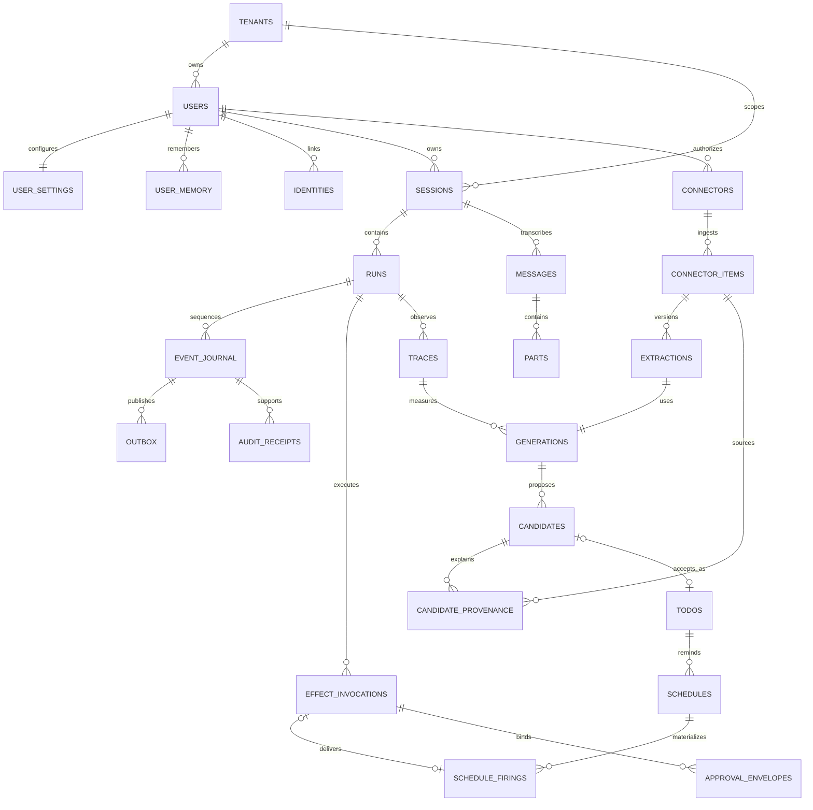

# Sherpa v1 data-model contract

**Status:** frozen for implementation  
**Database:** PostgreSQL 16  
**Access:** SQLAlchemy 2.0 async + asyncpg  
**Migrations:** Alembic, one migration owner

This contract is the complete v1 relational schema for the self-hosted, single-user
Gmail-to-Action product. The installation has one personal tenant and one active
owner, but every table carries `tenant_id`, and every relationship to a
tenant-owned row uses a composite foreign key containing `tenant_id`.

Forced RLS and least-privileged database roles are intentionally deferred by
ADR-015. They **must** be enabled before team or hosted multi-tenant operation.
The composite keys below are not optional even while v1 runs with one tenant.

The following are deferred and are **not in the v1 schema**: files/object storage,
tenant-shared memory, teams/memberships, GitHub, QQ/IM, agentic email,
sandbox/code execution, embeddings/pgvector/RAG, generic cron, and
multi-provider failover. v1 includes only the bounded user-private
`user_memory` key/value store defined below.
`approval_envelopes` is installed only because its one-way-door semantic contract
is frozen; v1 has no approval renderer or `ask`-gated external action.

## Contract boundaries

- Event envelope JSON, event types, cursor/reset behavior, and effect argument
  normalization are defined by
  [`events-and-effects.md`](events-and-effects.md). This document stores only
  their relational identity, ordering, hashes, and bounded/redacted payloads.
- HTTP request/response shapes and transition commands are defined by
  [`api.md`](api.md).
- KEK acquisition, OAuth scope allowlists, secret access authority, rotation,
  and redaction are defined by
  [`config-and-secrets.md`](config-and-secrets.md). Plaintext tokens must never
  enter PostgreSQL, events, outbox rows, audit receipts, traces, or logs.

## ER overview



## PostgreSQL DDL

Conventions:

- UUIDs are generated by the application before insert; no database extension is
  required.
- All timestamps are `timestamptz` and are written/read as UTC.
- Contract state values use `text` plus named `CHECK` constraints, avoiding
  PostgreSQL enum migration lock-in.
- `updated_at` is maintained by repositories in the same transaction as the
  business change.
- `ON DELETE RESTRICT` preserves provenance. Deleting the personal tenant is the
  explicit whole-installation purge path and cascades all tenant data.

```sql
BEGIN;

CREATE TABLE tenants (
    tenant_id uuid NOT NULL,
    slug varchar(63) NOT NULL,
    display_name varchar(200) NOT NULL,
    kind text NOT NULL DEFAULT 'personal',
    created_at timestamptz NOT NULL DEFAULT now(),
    updated_at timestamptz NOT NULL DEFAULT now(),
    CONSTRAINT pk_tenants PRIMARY KEY (tenant_id),
    CONSTRAINT uq_tenants_slug UNIQUE (slug),
    CONSTRAINT ck_tenants_slug
        CHECK (slug ~ '^[a-z0-9][a-z0-9-]{0,62}$'),
    CONSTRAINT ck_tenants_kind
        CHECK (kind = 'personal')
);

CREATE TABLE users (
    tenant_id uuid NOT NULL,
    id uuid NOT NULL,
    email text NOT NULL,
    display_name varchar(200) NOT NULL,
    status text NOT NULL DEFAULT 'active',
    created_at timestamptz NOT NULL DEFAULT now(),
    updated_at timestamptz NOT NULL DEFAULT now(),
    CONSTRAINT pk_users PRIMARY KEY (tenant_id, id),
    CONSTRAINT fk_users_tenant
        FOREIGN KEY (tenant_id) REFERENCES tenants (tenant_id)
        ON DELETE CASCADE,
    CONSTRAINT ck_users_email
        CHECK (char_length(email) BETWEEN 3 AND 320),
    CONSTRAINT ck_users_status
        CHECK (status IN ('active', 'disabled'))
);

CREATE UNIQUE INDEX ux_users_tenant_lower_email
    ON users (tenant_id, lower(email));

-- v1 has exactly one active owner. Drop this index only in the future
-- team-enablement migration that also introduces membership/RBAC semantics.
CREATE UNIQUE INDEX ux_users_one_active_owner_per_tenant
    ON users (tenant_id)
    WHERE status = 'active';

CREATE TABLE user_settings (
    tenant_id uuid NOT NULL,
    user_id uuid NOT NULL,
    notifications_enabled boolean NOT NULL DEFAULT false,
    web_enabled boolean NOT NULL DEFAULT true,
    email_digest_enabled boolean NOT NULL DEFAULT false,
    timezone text NOT NULL DEFAULT 'UTC',
    digest_time time NOT NULL DEFAULT TIME '08:00:00',
    quiet_hours_enabled boolean NOT NULL DEFAULT true,
    quiet_hours_start time NOT NULL DEFAULT TIME '22:00:00',
    quiet_hours_end time NOT NULL DEFAULT TIME '08:00:00',
    daily_cap integer NOT NULL DEFAULT 6,
    event_types text[] NOT NULL DEFAULT ARRAY[
        'new_candidate',
        'due_soon',
        'overdue',
        'run_failed'
    ]::text[],
    eventual_delivery_kinds text[] NOT NULL
        DEFAULT ARRAY['overdue']::text[],
    connector_analysis text NOT NULL DEFAULT 'candidate_first',
    todo_promotion text NOT NULL DEFAULT 'manual',
    external_actions text NOT NULL DEFAULT 'approval_required',
    version integer NOT NULL DEFAULT 1,
    created_at timestamptz NOT NULL DEFAULT now(),
    updated_at timestamptz NOT NULL DEFAULT now(),
    CONSTRAINT pk_user_settings PRIMARY KEY (tenant_id, user_id),
    CONSTRAINT fk_user_settings_tenant
        FOREIGN KEY (tenant_id) REFERENCES tenants (tenant_id)
        ON DELETE CASCADE,
    CONSTRAINT fk_user_settings_user
        FOREIGN KEY (tenant_id, user_id) REFERENCES users (tenant_id, id)
        ON DELETE CASCADE,
    CONSTRAINT ck_user_settings_timezone
        CHECK (char_length(timezone) BETWEEN 1 AND 100),
    CONSTRAINT ck_user_settings_quiet_hours
        CHECK (quiet_hours_start <> quiet_hours_end),
    CONSTRAINT ck_user_settings_daily_cap
        CHECK (daily_cap BETWEEN 0 AND 100),
    CONSTRAINT ck_user_settings_event_types
        CHECK (
            event_types <@ ARRAY[
                'new_candidate',
                'due_soon',
                'overdue',
                'run_failed'
            ]::text[]
        ),
    CONSTRAINT ck_user_settings_eventual_delivery
        CHECK (
            eventual_delivery_kinds
            <@ ARRAY['due_soon', 'overdue']::text[]
        ),
    CONSTRAINT ck_user_settings_connector_analysis
        CHECK (connector_analysis IN ('off', 'candidate_first')),
    CONSTRAINT ck_user_settings_todo_promotion
        CHECK (todo_promotion = 'manual'),
    CONSTRAINT ck_user_settings_external_actions
        CHECK (external_actions = 'approval_required'),
    CONSTRAINT ck_user_settings_version
        CHECK (version > 0)
);

CREATE TABLE user_memory (
    tenant_id uuid NOT NULL,
    user_id uuid NOT NULL,
    memory_key varchar(64) NOT NULL,
    value_text text NOT NULL,
    version integer NOT NULL DEFAULT 1,
    created_at timestamptz NOT NULL DEFAULT now(),
    updated_at timestamptz NOT NULL DEFAULT now(),
    CONSTRAINT pk_user_memory
        PRIMARY KEY (tenant_id, user_id, memory_key),
    CONSTRAINT fk_user_memory_tenant
        FOREIGN KEY (tenant_id) REFERENCES tenants (tenant_id)
        ON DELETE CASCADE,
    CONSTRAINT fk_user_memory_user
        FOREIGN KEY (tenant_id, user_id) REFERENCES users (tenant_id, id)
        ON DELETE CASCADE,
    CONSTRAINT ck_user_memory_key
        CHECK (memory_key ~ '^[a-z][a-z0-9_.-]{0,63}$'),
    CONSTRAINT ck_user_memory_value_bound
        CHECK (octet_length(value_text) <= 16384),
    CONSTRAINT ck_user_memory_version
        CHECK (version > 0)
);

CREATE TABLE identities (
    tenant_id uuid NOT NULL,
    id uuid NOT NULL,
    user_id uuid NOT NULL,
    channel text NOT NULL,
    channel_installation_id text NOT NULL,
    scope_type text NOT NULL,
    external_scope_id text NOT NULL,
    external_actor_id text NOT NULL,
    verified_at timestamptz NOT NULL,
    created_at timestamptz NOT NULL DEFAULT now(),
    CONSTRAINT pk_identities PRIMARY KEY (tenant_id, id),
    CONSTRAINT fk_identities_tenant
        FOREIGN KEY (tenant_id) REFERENCES tenants (tenant_id)
        ON DELETE CASCADE,
    CONSTRAINT fk_identities_user
        FOREIGN KEY (tenant_id, user_id) REFERENCES users (tenant_id, id)
        ON DELETE RESTRICT,
    CONSTRAINT uq_identities_canonical_scope
        UNIQUE (
            tenant_id,
            channel,
            channel_installation_id,
            scope_type,
            external_scope_id
        ),
    CONSTRAINT ck_identities_channel
        CHECK (char_length(channel) BETWEEN 1 AND 32),
    CONSTRAINT ck_identities_installation
        CHECK (char_length(channel_installation_id) BETWEEN 1 AND 255),
    CONSTRAINT ck_identities_scope_type
        CHECK (char_length(scope_type) BETWEEN 1 AND 32),
    CONSTRAINT ck_identities_external_scope
        CHECK (char_length(external_scope_id) BETWEEN 1 AND 512),
    CONSTRAINT ck_identities_external_actor
        CHECK (char_length(external_actor_id) BETWEEN 1 AND 512)
);

CREATE INDEX ix_identities_tenant_user
    ON identities (tenant_id, user_id);

CREATE TABLE sessions (
    tenant_id uuid NOT NULL,
    id uuid NOT NULL,
    user_id uuid NOT NULL,
    identity_id uuid,
    umo_key text NOT NULL,
    channel text NOT NULL,
    channel_installation_id text NOT NULL,
    scope_type text NOT NULL,
    external_scope_id text NOT NULL,
    status text NOT NULL DEFAULT 'open',
    admitted_seq bigint,
    promoted_seq bigint,
    fence_token bigint NOT NULL DEFAULT 0,
    input_tokens_rollup bigint NOT NULL DEFAULT 0,
    output_tokens_rollup bigint NOT NULL DEFAULT 0,
    cost_usd_rollup numeric(20, 8) NOT NULL DEFAULT 0,
    last_activity_at timestamptz,
    created_at timestamptz NOT NULL DEFAULT now(),
    updated_at timestamptz NOT NULL DEFAULT now(),
    CONSTRAINT pk_sessions PRIMARY KEY (tenant_id, id),
    CONSTRAINT fk_sessions_tenant
        FOREIGN KEY (tenant_id) REFERENCES tenants (tenant_id)
        ON DELETE CASCADE,
    CONSTRAINT fk_sessions_user
        FOREIGN KEY (tenant_id, user_id) REFERENCES users (tenant_id, id)
        ON DELETE RESTRICT,
    CONSTRAINT fk_sessions_identity
        FOREIGN KEY (tenant_id, identity_id)
        REFERENCES identities (tenant_id, id)
        ON DELETE RESTRICT,
    CONSTRAINT uq_sessions_umo_key
        UNIQUE (tenant_id, umo_key),
    CONSTRAINT uq_sessions_canonical_scope
        UNIQUE (
            tenant_id,
            channel,
            channel_installation_id,
            scope_type,
            external_scope_id
        ),
    CONSTRAINT ck_sessions_umo_key
        CHECK (char_length(umo_key) BETWEEN 1 AND 1024),
    CONSTRAINT ck_sessions_status
        CHECK (status IN ('open', 'archived', 'deleted')),
    CONSTRAINT ck_sessions_sequences
        CHECK (
            (admitted_seq IS NULL AND promoted_seq IS NULL)
            OR (
                admitted_seq IS NOT NULL
                AND admitted_seq > 0
                AND (promoted_seq IS NULL OR promoted_seq BETWEEN 1 AND admitted_seq)
            )
        ),
    CONSTRAINT ck_sessions_rollups
        CHECK (
            fence_token >= 0
            AND input_tokens_rollup >= 0
            AND output_tokens_rollup >= 0
            AND cost_usd_rollup >= 0
        )
);

CREATE INDEX ix_sessions_tenant_user_activity
    ON sessions (tenant_id, user_id, last_activity_at DESC);

CREATE TABLE runs (
    tenant_id uuid NOT NULL,
    id uuid NOT NULL,
    session_id uuid,
    run_kind text NOT NULL,
    admitted_seq bigint,
    status text NOT NULL DEFAULT 'queued',
    attempt integer NOT NULL DEFAULT 0,
    fence_token bigint NOT NULL DEFAULT 0,
    prompt_version text NOT NULL,
    deadline_at timestamptz,
    started_at timestamptz,
    settled_at timestamptz,
    error_redacted text,
    created_at timestamptz NOT NULL DEFAULT now(),
    updated_at timestamptz NOT NULL DEFAULT now(),
    CONSTRAINT pk_runs PRIMARY KEY (tenant_id, id),
    CONSTRAINT uq_runs_session_binding
        UNIQUE (tenant_id, id, session_id),
    CONSTRAINT fk_runs_tenant
        FOREIGN KEY (tenant_id) REFERENCES tenants (tenant_id)
        ON DELETE CASCADE,
    CONSTRAINT fk_runs_session
        FOREIGN KEY (tenant_id, session_id) REFERENCES sessions (tenant_id, id)
        ON DELETE RESTRICT,
    CONSTRAINT ck_runs_kind
        CHECK (
            run_kind IN (
                'web_chat',
                'gmail_sync',
                'candidate_extraction',
                'schedule_delivery'
            )
        ),
    CONSTRAINT ck_runs_status
        CHECK (
            status IN (
                'queued',
                'running',
                'succeeded',
                'failed',
                'cancelled',
                'needs_reconciliation'
            )
        ),
    CONSTRAINT ck_runs_numbers
        CHECK (
            attempt >= 0
            AND fence_token >= 0
            AND (admitted_seq IS NULL OR admitted_seq > 0)
        ),
    CONSTRAINT ck_runs_session_admission
        CHECK (session_id IS NOT NULL OR admitted_seq IS NULL),
    CONSTRAINT ck_runs_error_bound
        CHECK (
            error_redacted IS NULL
            OR octet_length(error_redacted) <= 16384
        ),
    CONSTRAINT ck_runs_settled_time
        CHECK (
            (status IN ('queued', 'running') AND settled_at IS NULL)
            OR (
                status IN (
                    'succeeded',
                    'failed',
                    'cancelled',
                    'needs_reconciliation'
                )
                AND settled_at IS NOT NULL
            )
        )
);

CREATE INDEX ix_runs_tenant_status_created
    ON runs (tenant_id, status, created_at);

CREATE INDEX ix_runs_tenant_session_created
    ON runs (tenant_id, session_id, created_at DESC)
    WHERE session_id IS NOT NULL;

CREATE TABLE messages (
    tenant_id uuid NOT NULL,
    id uuid NOT NULL,
    session_id uuid NOT NULL,
    run_id uuid,
    author_user_id uuid,
    client_message_id uuid,
    seq bigint NOT NULL,
    role text NOT NULL,
    created_at timestamptz NOT NULL DEFAULT now(),
    CONSTRAINT pk_messages PRIMARY KEY (tenant_id, id),
    CONSTRAINT fk_messages_tenant
        FOREIGN KEY (tenant_id) REFERENCES tenants (tenant_id)
        ON DELETE CASCADE,
    CONSTRAINT fk_messages_session
        FOREIGN KEY (tenant_id, session_id) REFERENCES sessions (tenant_id, id)
        ON DELETE RESTRICT,
    CONSTRAINT fk_messages_run
        FOREIGN KEY (tenant_id, run_id) REFERENCES runs (tenant_id, id)
        ON DELETE RESTRICT,
    CONSTRAINT fk_messages_author
        FOREIGN KEY (tenant_id, author_user_id) REFERENCES users (tenant_id, id)
        ON DELETE RESTRICT,
    CONSTRAINT uq_messages_session_seq
        UNIQUE (tenant_id, session_id, seq),
    CONSTRAINT ck_messages_seq
        CHECK (seq > 0),
    CONSTRAINT ck_messages_role
        CHECK (role IN ('user', 'assistant', 'system'))
);

CREATE INDEX ix_messages_tenant_session_created
    ON messages (tenant_id, session_id, created_at);

-- Durable-admission idempotency: client_message_id is unique within a session
-- (NULL for agent-authored assistant/system messages), backing api.md §4.
CREATE UNIQUE INDEX uq_messages_client_message_id
    ON messages (tenant_id, session_id, client_message_id)
    WHERE client_message_id IS NOT NULL;

CREATE TABLE parts (
    tenant_id uuid NOT NULL,
    id uuid NOT NULL,
    message_id uuid NOT NULL,
    ordinal integer NOT NULL,
    kind text NOT NULL,
    content_redacted jsonb NOT NULL,
    created_at timestamptz NOT NULL DEFAULT now(),
    CONSTRAINT pk_parts PRIMARY KEY (tenant_id, id),
    CONSTRAINT fk_parts_tenant
        FOREIGN KEY (tenant_id) REFERENCES tenants (tenant_id)
        ON DELETE CASCADE,
    CONSTRAINT fk_parts_message
        FOREIGN KEY (tenant_id, message_id) REFERENCES messages (tenant_id, id)
        ON DELETE RESTRICT,
    CONSTRAINT uq_parts_message_ordinal
        UNIQUE (tenant_id, message_id, ordinal),
    CONSTRAINT ck_parts_ordinal
        CHECK (ordinal >= 0),
    CONSTRAINT ck_parts_kind
        CHECK (kind IN ('text', 'status')),
    CONSTRAINT ck_parts_content_bound
        CHECK (octet_length(content_redacted::text) <= 65536)
);

-- These deferred pointer FKs make admitted_seq/promoted_seq real transcript
-- positions rather than unchecked counters.
ALTER TABLE sessions
    ADD CONSTRAINT fk_sessions_admitted_message
    FOREIGN KEY (tenant_id, id, admitted_seq)
    REFERENCES messages (tenant_id, session_id, seq)
    DEFERRABLE INITIALLY DEFERRED,
    ADD CONSTRAINT fk_sessions_promoted_message
    FOREIGN KEY (tenant_id, id, promoted_seq)
    REFERENCES messages (tenant_id, session_id, seq)
    DEFERRABLE INITIALLY DEFERRED;

ALTER TABLE runs
    ADD CONSTRAINT fk_runs_admitted_message
    FOREIGN KEY (tenant_id, session_id, admitted_seq)
    REFERENCES messages (tenant_id, session_id, seq)
    DEFERRABLE INITIALLY DEFERRED;

CREATE TABLE traces (
    tenant_id uuid NOT NULL,
    id uuid NOT NULL,
    parent_trace_id uuid,
    run_id uuid,
    session_id uuid,
    user_id uuid,
    trace_kind text NOT NULL,
    status text NOT NULL DEFAULT 'running',
    tags jsonb NOT NULL DEFAULT '{}'::jsonb,
    started_at timestamptz NOT NULL DEFAULT now(),
    ended_at timestamptz,
    CONSTRAINT pk_traces PRIMARY KEY (tenant_id, id),
    CONSTRAINT fk_traces_tenant
        FOREIGN KEY (tenant_id) REFERENCES tenants (tenant_id)
        ON DELETE CASCADE,
    CONSTRAINT fk_traces_parent
        FOREIGN KEY (tenant_id, parent_trace_id) REFERENCES traces (tenant_id, id)
        ON DELETE RESTRICT,
    CONSTRAINT fk_traces_run
        FOREIGN KEY (tenant_id, run_id) REFERENCES runs (tenant_id, id)
        ON DELETE RESTRICT,
    CONSTRAINT fk_traces_session
        FOREIGN KEY (tenant_id, session_id) REFERENCES sessions (tenant_id, id)
        ON DELETE RESTRICT,
    CONSTRAINT fk_traces_user
        FOREIGN KEY (tenant_id, user_id) REFERENCES users (tenant_id, id)
        ON DELETE RESTRICT,
    CONSTRAINT ck_traces_kind
        CHECK (
            trace_kind IN (
                'web_chat',
                'gmail_sync',
                'candidate_extraction',
                'schedule_delivery'
            )
        ),
    CONSTRAINT ck_traces_status
        CHECK (status IN ('running', 'succeeded', 'failed', 'cancelled')),
    CONSTRAINT ck_traces_tags_bound
        CHECK (octet_length(tags::text) <= 16384),
    CONSTRAINT ck_traces_ended
        CHECK (
            (status = 'running' AND ended_at IS NULL)
            OR (status <> 'running' AND ended_at IS NOT NULL)
        )
);

CREATE INDEX ix_traces_tenant_run
    ON traces (tenant_id, run_id)
    WHERE run_id IS NOT NULL;

CREATE TABLE connectors (
    tenant_id uuid NOT NULL,
    id uuid NOT NULL,
    user_id uuid NOT NULL,
    kind text NOT NULL,
    channel_installation_id text NOT NULL,
    external_account_id text NOT NULL,
    token_enc bytea,
    nonce bytea,
    kek_id text,
    key_version integer,
    token_algorithm text,
    aad_version smallint,
    scopes text[] NOT NULL DEFAULT ARRAY[]::text[],
    status text NOT NULL DEFAULT 'pending_oauth',
    cursor jsonb NOT NULL DEFAULT '{}'::jsonb,
    refresh_version bigint NOT NULL DEFAULT 0,
    last_sync_at timestamptz,
    last_error_redacted text,
    rotated_at timestamptz,
    created_at timestamptz NOT NULL DEFAULT now(),
    updated_at timestamptz NOT NULL DEFAULT now(),
    CONSTRAINT pk_connectors PRIMARY KEY (tenant_id, id),
    CONSTRAINT fk_connectors_tenant
        FOREIGN KEY (tenant_id) REFERENCES tenants (tenant_id)
        ON DELETE CASCADE,
    CONSTRAINT fk_connectors_user
        FOREIGN KEY (tenant_id, user_id) REFERENCES users (tenant_id, id)
        ON DELETE RESTRICT,
    CONSTRAINT uq_connectors_external_account
        UNIQUE (tenant_id, kind, external_account_id),
    CONSTRAINT uq_connectors_installation
        UNIQUE (tenant_id, channel_installation_id),
    CONSTRAINT ck_connectors_kind
        CHECK (kind = 'gmail'),
    CONSTRAINT ck_connectors_status
        CHECK (
            status IN (
                'pending_oauth',
                'active',
                'syncing',
                'degraded',
                'paused',
                'disconnecting',
                'revoked',
                'error'
            )
        ),
    CONSTRAINT ck_connectors_aead_all_or_none
        CHECK (
            (
                token_enc IS NULL
                AND nonce IS NULL
                AND kek_id IS NULL
                AND key_version IS NULL
                AND token_algorithm IS NULL
                AND aad_version IS NULL
            )
            OR (
                token_enc IS NOT NULL
                AND nonce IS NOT NULL
                AND kek_id IS NOT NULL
                AND key_version IS NOT NULL
                AND token_algorithm IS NOT NULL
                AND aad_version IS NOT NULL
            )
        ),
    CONSTRAINT ck_connectors_active_has_token
        CHECK (
            status NOT IN (
                'active',
                'syncing',
                'degraded',
                'paused',
                'disconnecting',
                'error'
            )
            OR token_enc IS NOT NULL
        ),
    CONSTRAINT ck_connectors_revoked_has_no_token
        CHECK (
            status <> 'revoked'
            OR (
                token_enc IS NULL
                AND nonce IS NULL
                AND kek_id IS NULL
                AND key_version IS NULL
                AND token_algorithm IS NULL
                AND aad_version IS NULL
            )
        ),
    CONSTRAINT ck_connectors_aead_values
        CHECK (
            token_enc IS NULL
            OR (
                octet_length(token_enc) >= 16
                AND octet_length(nonce) = 12
                AND key_version > 0
                AND token_algorithm = 'AES-256-GCM'
                AND aad_version > 0
            )
        ),
    CONSTRAINT ck_connectors_scopes
        CHECK (
            cardinality(scopes) <= 16
            AND (
                status <> 'active'
                OR cardinality(scopes) > 0
            )
        ),
    CONSTRAINT ck_connectors_cursor_bound
        CHECK (octet_length(cursor::text) <= 65536),
    CONSTRAINT ck_connectors_refresh_version
        CHECK (refresh_version >= 0),
    CONSTRAINT ck_connectors_error_bound
        CHECK (
            last_error_redacted IS NULL
            OR octet_length(last_error_redacted) <= 16384
        )
);

CREATE UNIQUE INDEX ux_connectors_aead_nonce
    ON connectors (tenant_id, kek_id, key_version, nonce)
    WHERE nonce IS NOT NULL;

CREATE INDEX ix_connectors_tenant_status
    ON connectors (tenant_id, status);

CREATE TABLE connector_items (
    tenant_id uuid NOT NULL,
    id uuid NOT NULL,
    connector_id uuid NOT NULL,
    provider_item_id text NOT NULL,
    revision text NOT NULL,
    provider_thread_id text,
    received_at timestamptz NOT NULL,
    fetched_at timestamptz NOT NULL DEFAULT now(),
    content_digest bytea NOT NULL,
    content_json jsonb,
    is_latest boolean NOT NULL DEFAULT true,
    deletion_state text NOT NULL DEFAULT 'present',
    source_deleted_at timestamptz,
    created_at timestamptz NOT NULL DEFAULT now(),
    CONSTRAINT pk_connector_items PRIMARY KEY (tenant_id, id),
    CONSTRAINT fk_connector_items_tenant
        FOREIGN KEY (tenant_id) REFERENCES tenants (tenant_id)
        ON DELETE CASCADE,
    CONSTRAINT fk_connector_items_connector
        FOREIGN KEY (tenant_id, connector_id)
        REFERENCES connectors (tenant_id, id)
        ON DELETE RESTRICT,
    CONSTRAINT uq_connector_items_revision
        UNIQUE (
            tenant_id,
            connector_id,
            provider_item_id,
            revision
        ),
    CONSTRAINT uq_connector_items_id_revision
        UNIQUE (tenant_id, id, revision),
    CONSTRAINT ck_connector_items_ids
        CHECK (
            char_length(provider_item_id) BETWEEN 1 AND 512
            AND char_length(revision) BETWEEN 1 AND 255
        ),
    CONSTRAINT ck_connector_items_digest
        CHECK (octet_length(content_digest) = 32),
    CONSTRAINT ck_connector_items_content_bound
        CHECK (
            content_json IS NULL
            OR octet_length(content_json::text) <= 262144
        ),
    CONSTRAINT ck_connector_items_deletion
        CHECK (
            (deletion_state = 'present' AND source_deleted_at IS NULL)
            OR (
                deletion_state = 'source_deleted'
                AND source_deleted_at IS NOT NULL
            )
            OR (
                deletion_state = 'purged'
                AND source_deleted_at IS NOT NULL
                AND content_json IS NULL
            )
        )
);

CREATE UNIQUE INDEX ux_connector_items_latest
    ON connector_items (tenant_id, connector_id, provider_item_id)
    WHERE is_latest;

CREATE INDEX ix_connector_items_thread_received
    ON connector_items (
        tenant_id,
        connector_id,
        provider_thread_id,
        received_at DESC
    );

CREATE TABLE extractions (
    tenant_id uuid NOT NULL,
    id uuid NOT NULL,
    connector_item_id uuid NOT NULL,
    run_id uuid NOT NULL,
    extraction_version integer NOT NULL,
    extractor_version text NOT NULL,
    output_schema_version smallint NOT NULL,
    status text NOT NULL DEFAULT 'pending',
    attempts integer NOT NULL DEFAULT 0,
    error_redacted text,
    started_at timestamptz,
    completed_at timestamptz,
    created_at timestamptz NOT NULL DEFAULT now(),
    CONSTRAINT pk_extractions PRIMARY KEY (tenant_id, id),
    CONSTRAINT fk_extractions_tenant
        FOREIGN KEY (tenant_id) REFERENCES tenants (tenant_id)
        ON DELETE CASCADE,
    CONSTRAINT fk_extractions_item
        FOREIGN KEY (tenant_id, connector_item_id)
        REFERENCES connector_items (tenant_id, id)
        ON DELETE RESTRICT,
    CONSTRAINT fk_extractions_run
        FOREIGN KEY (tenant_id, run_id) REFERENCES runs (tenant_id, id)
        ON DELETE RESTRICT,
    CONSTRAINT uq_extractions_item_version
        UNIQUE (tenant_id, connector_item_id, extraction_version),
    CONSTRAINT uq_extractions_chain
        UNIQUE (
            tenant_id,
            id,
            connector_item_id,
            extraction_version
        ),
    CONSTRAINT ck_extractions_versions
        CHECK (extraction_version > 0 AND output_schema_version > 0),
    CONSTRAINT ck_extractions_status
        CHECK (status IN ('pending', 'running', 'succeeded', 'failed')),
    CONSTRAINT ck_extractions_attempts
        CHECK (attempts >= 0),
    CONSTRAINT ck_extractions_error_bound
        CHECK (
            error_redacted IS NULL
            OR octet_length(error_redacted) <= 16384
        ),
    CONSTRAINT ck_extractions_completed
        CHECK (
            (status IN ('pending', 'running') AND completed_at IS NULL)
            OR (status IN ('succeeded', 'failed') AND completed_at IS NOT NULL)
        )
);

CREATE INDEX ix_extractions_tenant_status_created
    ON extractions (tenant_id, status, created_at);

CREATE TABLE generations (
    tenant_id uuid NOT NULL,
    id uuid NOT NULL,
    trace_id uuid NOT NULL,
    run_id uuid NOT NULL,
    extraction_id uuid,
    purpose text NOT NULL,
    provider text NOT NULL,
    model text NOT NULL,
    prompt_version text NOT NULL,
    response_schema_version smallint,
    status text NOT NULL,
    attempt integer NOT NULL DEFAULT 1,
    input_tokens bigint NOT NULL DEFAULT 0,
    output_tokens bigint NOT NULL DEFAULT 0,
    cached_input_tokens bigint NOT NULL DEFAULT 0,
    cost_usd numeric(20, 8) NOT NULL DEFAULT 0,
    latency_ms integer,
    started_at timestamptz NOT NULL,
    completed_at timestamptz NOT NULL,
    CONSTRAINT pk_generations PRIMARY KEY (tenant_id, id),
    CONSTRAINT uq_generations_chain
        UNIQUE (tenant_id, id, extraction_id),
    CONSTRAINT fk_generations_tenant
        FOREIGN KEY (tenant_id) REFERENCES tenants (tenant_id)
        ON DELETE CASCADE,
    CONSTRAINT fk_generations_trace
        FOREIGN KEY (tenant_id, trace_id) REFERENCES traces (tenant_id, id)
        ON DELETE RESTRICT,
    CONSTRAINT fk_generations_run
        FOREIGN KEY (tenant_id, run_id) REFERENCES runs (tenant_id, id)
        ON DELETE RESTRICT,
    CONSTRAINT fk_generations_extraction
        FOREIGN KEY (tenant_id, extraction_id)
        REFERENCES extractions (tenant_id, id)
        ON DELETE RESTRICT,
    CONSTRAINT ck_generations_purpose
        CHECK (purpose IN ('web_chat', 'candidate_extraction', 'digest')),
    CONSTRAINT ck_generations_extraction_purpose
        CHECK (
            (purpose = 'candidate_extraction' AND extraction_id IS NOT NULL)
            OR (purpose IN ('web_chat', 'digest') AND extraction_id IS NULL)
        ),
    CONSTRAINT ck_generations_status
        CHECK (status IN ('succeeded', 'failed')),
    CONSTRAINT ck_generations_usage
        CHECK (
            attempt > 0
            AND input_tokens >= 0
            AND output_tokens >= 0
            AND cached_input_tokens >= 0
            AND cached_input_tokens <= input_tokens
            AND cost_usd >= 0
            AND (latency_ms IS NULL OR latency_ms >= 0)
            AND completed_at >= started_at
        ),
    CONSTRAINT ck_generations_schema_version
        CHECK (
            response_schema_version IS NULL
            OR response_schema_version > 0
        )
);

CREATE UNIQUE INDEX ux_generations_one_per_extraction
    ON generations (tenant_id, extraction_id)
    WHERE extraction_id IS NOT NULL;

CREATE INDEX ix_generations_tenant_run
    ON generations (tenant_id, run_id, started_at);

CREATE TABLE candidates (
    tenant_id uuid NOT NULL,
    id uuid NOT NULL,
    extraction_id uuid NOT NULL,
    generation_id uuid NOT NULL,
    ordinal integer NOT NULL,
    dedupe_key text NOT NULL,
    status text NOT NULL DEFAULT 'pending',
    title varchar(500) NOT NULL,
    description text,
    due_at timestamptz,
    priority text NOT NULL DEFAULT 'medium',
    confidence numeric(5, 4) NOT NULL,
    rationale_redacted text,
    source_excerpt_redacted text,
    accepted_todo_id uuid,
    decided_by_user_id uuid,
    decided_at timestamptz,
    version integer NOT NULL DEFAULT 1,
    created_at timestamptz NOT NULL DEFAULT now(),
    updated_at timestamptz NOT NULL DEFAULT now(),
    CONSTRAINT pk_candidates PRIMARY KEY (tenant_id, id),
    CONSTRAINT uq_candidates_dedupe
        UNIQUE (tenant_id, dedupe_key),
    CONSTRAINT uq_candidates_extraction_ordinal
        UNIQUE (tenant_id, extraction_id, ordinal),
    CONSTRAINT uq_candidates_chain
        UNIQUE (tenant_id, id, generation_id, extraction_id),
    CONSTRAINT uq_candidates_todo_link
        UNIQUE (tenant_id, id, accepted_todo_id),
    CONSTRAINT fk_candidates_tenant
        FOREIGN KEY (tenant_id) REFERENCES tenants (tenant_id)
        ON DELETE CASCADE,
    CONSTRAINT fk_candidates_extraction
        FOREIGN KEY (tenant_id, extraction_id)
        REFERENCES extractions (tenant_id, id)
        ON DELETE RESTRICT,
    CONSTRAINT fk_candidates_generation_extraction
        FOREIGN KEY (tenant_id, generation_id, extraction_id)
        REFERENCES generations (tenant_id, id, extraction_id)
        ON DELETE RESTRICT,
    CONSTRAINT fk_candidates_decider
        FOREIGN KEY (tenant_id, decided_by_user_id)
        REFERENCES users (tenant_id, id)
        ON DELETE RESTRICT,
    CONSTRAINT ck_candidates_ordinal
        CHECK (ordinal >= 0),
    CONSTRAINT ck_candidates_dedupe_key
        CHECK (char_length(dedupe_key) BETWEEN 1 AND 512),
    CONSTRAINT ck_candidates_status
        CHECK (status IN ('pending', 'accepted', 'edited', 'dismissed')),
    CONSTRAINT ck_candidates_priority
        CHECK (priority IN ('low', 'medium', 'high')),
    CONSTRAINT ck_candidates_confidence
        CHECK (confidence BETWEEN 0 AND 1),
    CONSTRAINT ck_candidates_description_bound
        CHECK (
            description IS NULL
            OR octet_length(description) <= 65536
        ),
    CONSTRAINT ck_candidates_rationale_bound
        CHECK (
            rationale_redacted IS NULL
            OR octet_length(rationale_redacted) <= 16384
        ),
    CONSTRAINT ck_candidates_excerpt_bound
        CHECK (
            source_excerpt_redacted IS NULL
            OR octet_length(source_excerpt_redacted) <= 16384
        ),
    CONSTRAINT ck_candidates_decision
        CHECK (
            (
                status = 'pending'
                AND accepted_todo_id IS NULL
                AND decided_by_user_id IS NULL
                AND decided_at IS NULL
            )
            OR (
                status IN ('accepted', 'edited')
                AND accepted_todo_id IS NOT NULL
                AND decided_by_user_id IS NOT NULL
                AND decided_at IS NOT NULL
            )
            OR (
                status = 'dismissed'
                AND accepted_todo_id IS NULL
                AND decided_by_user_id IS NOT NULL
                AND decided_at IS NOT NULL
            )
        ),
    CONSTRAINT ck_candidates_version
        CHECK (version > 0)
);

CREATE INDEX ix_candidates_tenant_status_created
    ON candidates (tenant_id, status, created_at DESC);

CREATE TABLE todos (
    tenant_id uuid NOT NULL,
    id uuid NOT NULL,
    user_id uuid NOT NULL,
    source_candidate_id uuid NOT NULL,
    source text NOT NULL DEFAULT 'gmail_candidate',
    title varchar(500) NOT NULL,
    description text,
    status text NOT NULL DEFAULT 'open',
    due_at timestamptz,
    snoozed_until timestamptz,
    priority text NOT NULL DEFAULT 'medium',
    completed_at timestamptz,
    version integer NOT NULL DEFAULT 1,
    created_at timestamptz NOT NULL DEFAULT now(),
    updated_at timestamptz NOT NULL DEFAULT now(),
    CONSTRAINT pk_todos PRIMARY KEY (tenant_id, id),
    CONSTRAINT uq_todos_source_candidate
        UNIQUE (tenant_id, source_candidate_id),
    CONSTRAINT fk_todos_tenant
        FOREIGN KEY (tenant_id) REFERENCES tenants (tenant_id)
        ON DELETE CASCADE,
    CONSTRAINT fk_todos_user
        FOREIGN KEY (tenant_id, user_id) REFERENCES users (tenant_id, id)
        ON DELETE RESTRICT,
    CONSTRAINT ck_todos_source
        CHECK (source = 'gmail_candidate'),
    CONSTRAINT ck_todos_status
        CHECK (status IN ('open', 'completed', 'cancelled')),
    CONSTRAINT ck_todos_priority
        CHECK (priority IN ('low', 'medium', 'high')),
    CONSTRAINT ck_todos_description_bound
        CHECK (
            description IS NULL
            OR octet_length(description) <= 65536
        ),
    CONSTRAINT ck_todos_completion
        CHECK (
            (
                status = 'completed'
                AND completed_at IS NOT NULL
                AND snoozed_until IS NULL
            )
            OR (status = 'open' AND completed_at IS NULL)
            OR (
                status = 'cancelled'
                AND completed_at IS NULL
                AND snoozed_until IS NULL
            )
        ),
    CONSTRAINT ck_todos_version
        CHECK (version > 0)
);

-- Candidate acceptance and todo creation use preallocated UUIDs in one
-- transaction. Deferred constraints enforce a true one-to-one, bidirectional
-- link without a transient invalid state.
ALTER TABLE candidates
    ADD CONSTRAINT fk_candidates_accepted_todo
    FOREIGN KEY (tenant_id, accepted_todo_id)
    REFERENCES todos (tenant_id, id)
    DEFERRABLE INITIALLY DEFERRED;

ALTER TABLE todos
    ADD CONSTRAINT fk_todos_source_candidate_backlink
    FOREIGN KEY (tenant_id, source_candidate_id, id)
    REFERENCES candidates (tenant_id, id, accepted_todo_id)
    DEFERRABLE INITIALLY DEFERRED;

CREATE INDEX ix_todos_tenant_status_due
    ON todos (tenant_id, status, due_at)
    WHERE status = 'open';

CREATE TABLE candidate_provenance (
    tenant_id uuid NOT NULL,
    id uuid NOT NULL,
    candidate_id uuid NOT NULL,
    connector_item_id uuid NOT NULL,
    connector_revision text NOT NULL,
    extraction_id uuid NOT NULL,
    extraction_version integer NOT NULL,
    generation_id uuid NOT NULL,
    accepted_todo_id uuid,
    relation text NOT NULL DEFAULT 'primary',
    created_at timestamptz NOT NULL DEFAULT now(),
    updated_at timestamptz NOT NULL DEFAULT now(),
    CONSTRAINT pk_candidate_provenance PRIMARY KEY (tenant_id, id),
    CONSTRAINT fk_candidate_provenance_tenant
        FOREIGN KEY (tenant_id) REFERENCES tenants (tenant_id)
        ON DELETE CASCADE,
    CONSTRAINT fk_candidate_provenance_candidate_chain
        FOREIGN KEY (
            tenant_id,
            candidate_id,
            generation_id,
            extraction_id
        )
        REFERENCES candidates (
            tenant_id,
            id,
            generation_id,
            extraction_id
        )
        ON DELETE RESTRICT,
    CONSTRAINT fk_candidate_provenance_item_revision
        FOREIGN KEY (
            tenant_id,
            connector_item_id,
            connector_revision
        )
        REFERENCES connector_items (tenant_id, id, revision)
        ON DELETE RESTRICT,
    CONSTRAINT fk_candidate_provenance_extraction_chain
        FOREIGN KEY (
            tenant_id,
            extraction_id,
            connector_item_id,
            extraction_version
        )
        REFERENCES extractions (
            tenant_id,
            id,
            connector_item_id,
            extraction_version
        )
        ON DELETE RESTRICT,
    CONSTRAINT fk_candidate_provenance_generation_chain
        FOREIGN KEY (tenant_id, generation_id, extraction_id)
        REFERENCES generations (tenant_id, id, extraction_id)
        ON DELETE RESTRICT,
    CONSTRAINT fk_candidate_provenance_candidate_todo
        FOREIGN KEY (tenant_id, candidate_id, accepted_todo_id)
        REFERENCES candidates (tenant_id, id, accepted_todo_id)
        DEFERRABLE INITIALLY DEFERRED,
    CONSTRAINT fk_candidate_provenance_todo
        FOREIGN KEY (tenant_id, accepted_todo_id)
        REFERENCES todos (tenant_id, id)
        DEFERRABLE INITIALLY DEFERRED,
    CONSTRAINT uq_candidate_provenance_chain
        UNIQUE (
            tenant_id,
            candidate_id,
            connector_item_id,
            connector_revision,
            extraction_id,
            generation_id
        ),
    CONSTRAINT ck_candidate_provenance_relation
        CHECK (relation IN ('primary', 'merged'))
);

CREATE INDEX ix_candidate_provenance_tenant_item
    ON candidate_provenance (
        tenant_id,
        connector_item_id,
        connector_revision
    );

CREATE TABLE event_journal (
    tenant_id uuid NOT NULL,
    id uuid NOT NULL,
    session_id uuid,
    session_seq bigint,
    run_id uuid NOT NULL,
    run_seq bigint NOT NULL,
    event_type text NOT NULL,
    envelope_version smallint NOT NULL,
    durability text NOT NULL DEFAULT 'durable',
    correlation_id uuid,
    causation_event_id uuid,
    payload_redacted jsonb NOT NULL,
    payload_size_bytes integer NOT NULL,
    occurred_at timestamptz NOT NULL,
    created_at timestamptz NOT NULL DEFAULT now(),
    CONSTRAINT pk_event_journal PRIMARY KEY (tenant_id, id),
    CONSTRAINT fk_event_journal_tenant
        FOREIGN KEY (tenant_id) REFERENCES tenants (tenant_id)
        ON DELETE CASCADE,
    CONSTRAINT fk_event_journal_run
        FOREIGN KEY (tenant_id, run_id) REFERENCES runs (tenant_id, id)
        ON DELETE RESTRICT,
    CONSTRAINT fk_event_journal_run_session
        FOREIGN KEY (tenant_id, run_id, session_id)
        REFERENCES runs (tenant_id, id, session_id)
        ON DELETE RESTRICT,
    CONSTRAINT fk_event_journal_causation
        FOREIGN KEY (tenant_id, causation_event_id)
        REFERENCES event_journal (tenant_id, id)
        ON DELETE RESTRICT,
    CONSTRAINT uq_event_journal_run_seq
        UNIQUE (tenant_id, run_id, run_seq),
    CONSTRAINT ck_event_journal_sequences
        CHECK (
            run_seq > 0
            AND (
                (session_id IS NULL AND session_seq IS NULL)
                OR (
                    session_id IS NOT NULL
                    AND session_seq IS NOT NULL
                    AND session_seq > 0
                )
            )
        ),
    CONSTRAINT ck_event_journal_type
        CHECK (char_length(event_type) BETWEEN 1 AND 200),
    CONSTRAINT ck_event_journal_envelope
        CHECK (envelope_version > 0),
    CONSTRAINT ck_event_journal_durability
        CHECK (durability IN ('durable', 'presentation')),
    CONSTRAINT ck_event_journal_payload
        CHECK (
            payload_size_bytes = octet_length(payload_redacted::text)
            AND payload_size_bytes BETWEEN 2 AND 65536
        )
);

CREATE UNIQUE INDEX ux_event_journal_session_seq
    ON event_journal (tenant_id, session_id, session_seq)
    WHERE session_id IS NOT NULL;

CREATE INDEX ix_event_journal_tenant_type_created
    ON event_journal (tenant_id, event_type, created_at DESC);

CREATE INDEX ix_event_journal_tenant_correlation
    ON event_journal (tenant_id, correlation_id)
    WHERE correlation_id IS NOT NULL;

CREATE TABLE outbox (
    tenant_id uuid NOT NULL,
    id uuid NOT NULL,
    event_id uuid NOT NULL,
    topic text NOT NULL,
    delivery_key text NOT NULL,
    status text NOT NULL DEFAULT 'pending',
    attempts integer NOT NULL DEFAULT 0,
    available_at timestamptz NOT NULL DEFAULT now(),
    locked_by text,
    locked_at timestamptz,
    delivered_at timestamptz,
    last_error_redacted text,
    created_at timestamptz NOT NULL DEFAULT now(),
    CONSTRAINT pk_outbox PRIMARY KEY (tenant_id, id),
    CONSTRAINT fk_outbox_tenant
        FOREIGN KEY (tenant_id) REFERENCES tenants (tenant_id)
        ON DELETE CASCADE,
    CONSTRAINT fk_outbox_event
        FOREIGN KEY (tenant_id, event_id)
        REFERENCES event_journal (tenant_id, id)
        ON DELETE RESTRICT,
    CONSTRAINT uq_outbox_event_topic
        UNIQUE (tenant_id, event_id, topic),
    CONSTRAINT uq_outbox_delivery_key
        UNIQUE (tenant_id, topic, delivery_key),
    CONSTRAINT ck_outbox_status
        CHECK (status IN ('pending', 'publishing', 'delivered', 'failed')),
    CONSTRAINT ck_outbox_attempts
        CHECK (attempts >= 0),
    CONSTRAINT ck_outbox_delivery
        CHECK (
            (status = 'delivered' AND delivered_at IS NOT NULL)
            OR (status <> 'delivered' AND delivered_at IS NULL)
        ),
    CONSTRAINT ck_outbox_error_bound
        CHECK (
            last_error_redacted IS NULL
            OR octet_length(last_error_redacted) <= 16384
        )
);

CREATE INDEX ix_outbox_ready
    ON outbox (available_at, created_at)
    WHERE status IN ('pending', 'publishing');

CREATE TABLE effect_invocations (
    tenant_id uuid NOT NULL,
    invocation_id uuid NOT NULL,
    run_id uuid NOT NULL,
    turn_seq bigint,
    effect_name text NOT NULL,
    idempotency_key text NOT NULL,
    effect_class text NOT NULL,
    retry_policy text NOT NULL,
    args_hash bytea NOT NULL,
    status text NOT NULL DEFAULT 'prepared',
    outcome text,
    attempts integer NOT NULL DEFAULT 0,
    reconciliation_state text NOT NULL DEFAULT 'not_required',
    result_redacted jsonb,
    external_reference_redacted text,
    last_error_redacted text,
    started_at timestamptz,
    settled_at timestamptz,
    created_at timestamptz NOT NULL DEFAULT now(),
    updated_at timestamptz NOT NULL DEFAULT now(),
    CONSTRAINT pk_effect_invocations
        PRIMARY KEY (tenant_id, invocation_id),
    CONSTRAINT uq_effect_invocations_class_binding
        UNIQUE (tenant_id, invocation_id, effect_class),
    CONSTRAINT fk_effect_invocations_tenant
        FOREIGN KEY (tenant_id) REFERENCES tenants (tenant_id)
        ON DELETE CASCADE,
    CONSTRAINT fk_effect_invocations_run
        FOREIGN KEY (tenant_id, run_id) REFERENCES runs (tenant_id, id)
        ON DELETE RESTRICT,
    CONSTRAINT uq_effect_invocations_idempotency
        UNIQUE (tenant_id, idempotency_key),
    CONSTRAINT ck_effect_invocations_turn
        CHECK (turn_seq IS NULL OR turn_seq > 0),
    CONSTRAINT ck_effect_invocations_name
        CHECK (char_length(effect_name) BETWEEN 1 AND 200),
    CONSTRAINT ck_effect_invocations_key
        CHECK (char_length(idempotency_key) BETWEEN 1 AND 512),
    CONSTRAINT ck_effect_invocations_class
        CHECK (
            effect_class IN (
                'read_only',
                'idempotent_write',
                'reconcilable_write',
                'non_idempotent_write'
            )
        ),
    CONSTRAINT ck_effect_invocations_retry_policy
        CHECK (
            retry_policy IN (
                'transient_before_dispatch',
                'same_key',
                'after_reconcile',
                'never'
            )
        ),
    CONSTRAINT ck_effect_invocations_hash
        CHECK (octet_length(args_hash) = 32),
    CONSTRAINT ck_effect_invocations_status
        CHECK (
            status IN (
                'prepared',
                'running',
                'settled',
                'needs_reconciliation'
            )
        ),
    CONSTRAINT ck_effect_invocations_outcome
        CHECK (
            outcome IS NULL
            OR outcome IN ('succeeded', 'failed', 'effect_unknown')
        ),
    CONSTRAINT ck_effect_invocations_reconciliation
        CHECK (
            reconciliation_state IN (
                'not_required',
                'pending',
                'manual_required',
                'resolved_succeeded',
                'resolved_failed'
            )
        ),
    CONSTRAINT ck_effect_invocations_state
        CHECK (
            (
                status IN ('prepared', 'running')
                AND outcome IS NULL
                AND settled_at IS NULL
            )
            OR (
                status = 'settled'
                AND outcome IN ('succeeded', 'failed')
                AND settled_at IS NOT NULL
            )
            OR (
                status = 'needs_reconciliation'
                AND outcome = 'effect_unknown'
                AND reconciliation_state IN ('pending', 'manual_required')
                AND settled_at IS NOT NULL
            )
        ),
    CONSTRAINT ck_effect_invocations_attempts
        CHECK (attempts >= 0),
    CONSTRAINT ck_effect_invocations_result_bound
        CHECK (
            result_redacted IS NULL
            OR octet_length(result_redacted::text) <= 65536
        ),
    CONSTRAINT ck_effect_invocations_external_ref_bound
        CHECK (
            external_reference_redacted IS NULL
            OR octet_length(external_reference_redacted) <= 2048
        ),
    CONSTRAINT ck_effect_invocations_error_bound
        CHECK (
            last_error_redacted IS NULL
            OR octet_length(last_error_redacted) <= 16384
        )
);

CREATE INDEX ix_effect_invocations_unresolved
    ON effect_invocations (tenant_id, status, created_at)
    WHERE status IN ('prepared', 'running', 'needs_reconciliation');

CREATE TABLE schedules (
    tenant_id uuid NOT NULL,
    id uuid NOT NULL,
    user_id uuid NOT NULL,
    todo_id uuid,
    kind text NOT NULL,
    name varchar(200) NOT NULL,
    reminder_kind text,
    delivery_channel text NOT NULL,
    timezone text NOT NULL,
    local_time time,
    next_fire_at timestamptz NOT NULL,
    last_fired_at timestamptz,
    misfire_policy text NOT NULL,
    duplicate_policy text NOT NULL,
    status text NOT NULL DEFAULT 'active',
    version integer NOT NULL DEFAULT 1,
    created_at timestamptz NOT NULL DEFAULT now(),
    updated_at timestamptz NOT NULL DEFAULT now(),
    CONSTRAINT pk_schedules PRIMARY KEY (tenant_id, id),
    CONSTRAINT fk_schedules_tenant
        FOREIGN KEY (tenant_id) REFERENCES tenants (tenant_id)
        ON DELETE CASCADE,
    CONSTRAINT fk_schedules_user
        FOREIGN KEY (tenant_id, user_id) REFERENCES users (tenant_id, id)
        ON DELETE RESTRICT,
    CONSTRAINT fk_schedules_todo
        FOREIGN KEY (tenant_id, todo_id) REFERENCES todos (tenant_id, id)
        ON DELETE RESTRICT,
    CONSTRAINT ck_schedules_kind
        CHECK (kind IN ('todo_reminder', 'daily_digest')),
    CONSTRAINT ck_schedules_name
        CHECK (char_length(name) BETWEEN 1 AND 200),
    CONSTRAINT ck_schedules_reminder_kind
        CHECK (
            reminder_kind IS NULL
            OR reminder_kind IN ('due_soon', 'overdue')
        ),
    CONSTRAINT ck_schedules_kind_target
        CHECK (
            (
                kind = 'todo_reminder'
                AND todo_id IS NOT NULL
                AND reminder_kind IS NOT NULL
                AND local_time IS NULL
            )
            OR (
                kind = 'daily_digest'
                AND todo_id IS NULL
                AND reminder_kind IS NULL
                AND local_time IS NOT NULL
            )
        ),
    CONSTRAINT ck_schedules_delivery_channel
        CHECK (delivery_channel IN ('web', 'digest_email')),
    CONSTRAINT ck_schedules_timezone
        CHECK (char_length(timezone) BETWEEN 1 AND 100),
    CONSTRAINT ck_schedules_misfire
        CHECK (misfire_policy IN ('skip', 'fire_once')),
    CONSTRAINT ck_schedules_duplicate
        CHECK (
            duplicate_policy IN (
                'prefer_no_duplicate',
                'eventual_delivery'
            )
        ),
    CONSTRAINT ck_schedules_status
        CHECK (status IN ('active', 'paused', 'completed', 'disabled')),
    CONSTRAINT ck_schedules_version
        CHECK (version > 0)
);

CREATE INDEX ix_schedules_due
    ON schedules (next_fire_at, tenant_id, id)
    WHERE status = 'active';

CREATE UNIQUE INDEX ux_schedules_active_todo_channel
    ON schedules (tenant_id, todo_id, reminder_kind, delivery_channel)
    WHERE kind = 'todo_reminder' AND status = 'active';

CREATE UNIQUE INDEX ux_schedules_active_digest_channel
    ON schedules (tenant_id, user_id, delivery_channel)
    WHERE kind = 'daily_digest' AND status = 'active';

CREATE TABLE schedule_firings (
    tenant_id uuid NOT NULL,
    id uuid NOT NULL,
    schedule_id uuid NOT NULL,
    firing_key text NOT NULL,
    scheduled_for timestamptz NOT NULL,
    status text NOT NULL DEFAULT 'pending',
    delivery_outcome text,
    delivery_idempotency_key text NOT NULL,
    invocation_id uuid,
    attempts integer NOT NULL DEFAULT 0,
    available_at timestamptz NOT NULL DEFAULT now(),
    started_at timestamptz,
    settled_at timestamptz,
    last_error_redacted text,
    created_at timestamptz NOT NULL DEFAULT now(),
    updated_at timestamptz NOT NULL DEFAULT now(),
    CONSTRAINT pk_schedule_firings PRIMARY KEY (tenant_id, id),
    CONSTRAINT fk_schedule_firings_tenant
        FOREIGN KEY (tenant_id) REFERENCES tenants (tenant_id)
        ON DELETE CASCADE,
    CONSTRAINT fk_schedule_firings_schedule
        FOREIGN KEY (tenant_id, schedule_id)
        REFERENCES schedules (tenant_id, id)
        ON DELETE RESTRICT,
    CONSTRAINT fk_schedule_firings_invocation
        FOREIGN KEY (tenant_id, invocation_id)
        REFERENCES effect_invocations (tenant_id, invocation_id)
        ON DELETE RESTRICT,
    CONSTRAINT uq_schedule_firings_key
        UNIQUE (tenant_id, schedule_id, firing_key),
    CONSTRAINT uq_schedule_firings_slot
        UNIQUE (tenant_id, schedule_id, scheduled_for),
    CONSTRAINT uq_schedule_firings_delivery_key
        UNIQUE (tenant_id, delivery_idempotency_key),
    CONSTRAINT uq_schedule_firings_invocation
        UNIQUE (tenant_id, invocation_id),
    CONSTRAINT ck_schedule_firings_key
        CHECK (
            char_length(firing_key) BETWEEN 1 AND 512
            AND char_length(delivery_idempotency_key) BETWEEN 1 AND 512
        ),
    CONSTRAINT ck_schedule_firings_status
        CHECK (status IN ('pending', 'running', 'settled')),
    CONSTRAINT ck_schedule_firings_outcome
        CHECK (
            delivery_outcome IS NULL
            OR delivery_outcome IN ('missed', 'failed', 'unknown', 'delivered')
        ),
    CONSTRAINT ck_schedule_firings_state
        CHECK (
            (
                status IN ('pending', 'running')
                AND delivery_outcome IS NULL
                AND settled_at IS NULL
            )
            OR (
                status = 'settled'
                AND delivery_outcome IS NOT NULL
                AND settled_at IS NOT NULL
            )
        ),
    CONSTRAINT ck_schedule_firings_attempts
        CHECK (attempts >= 0),
    CONSTRAINT ck_schedule_firings_error_bound
        CHECK (
            last_error_redacted IS NULL
            OR octet_length(last_error_redacted) <= 16384
        )
);

CREATE INDEX ix_schedule_firings_ready
    ON schedule_firings (available_at, tenant_id, id)
    WHERE status = 'pending';

CREATE INDEX ix_schedule_firings_attention
    ON schedule_firings (tenant_id, delivery_outcome, settled_at DESC)
    WHERE delivery_outcome IN ('missed', 'failed', 'unknown');

CREATE TABLE approval_envelopes (
    tenant_id uuid NOT NULL,
    id uuid NOT NULL,
    envelope_version smallint NOT NULL,
    correlation_id uuid NOT NULL,
    run_id uuid NOT NULL,
    session_id uuid NOT NULL,
    invocation_id uuid NOT NULL,
    tool_name text NOT NULL,
    permission_scope text NOT NULL,
    effect_class text NOT NULL,
    args_hash bytea NOT NULL,
    policy_version text NOT NULL,
    expires_at timestamptz NOT NULL,
    nonce_hash bytea NOT NULL,
    preview_redacted jsonb NOT NULL,
    authorized_decider_user_id uuid NOT NULL,
    status text NOT NULL DEFAULT 'pending',
    decision text,
    decided_by_user_id uuid,
    decided_via_channel text,
    decided_at timestamptz,
    version integer NOT NULL DEFAULT 1,
    requested_at timestamptz NOT NULL DEFAULT now(),
    CONSTRAINT pk_approval_envelopes PRIMARY KEY (tenant_id, id),
    CONSTRAINT fk_approval_envelopes_tenant
        FOREIGN KEY (tenant_id) REFERENCES tenants (tenant_id)
        ON DELETE CASCADE,
    CONSTRAINT fk_approval_envelopes_run_session
        FOREIGN KEY (tenant_id, run_id, session_id)
        REFERENCES runs (tenant_id, id, session_id)
        ON DELETE RESTRICT,
    CONSTRAINT fk_approval_envelopes_invocation_class
        FOREIGN KEY (tenant_id, invocation_id, effect_class)
        REFERENCES effect_invocations (
            tenant_id,
            invocation_id,
            effect_class
        )
        ON DELETE RESTRICT,
    CONSTRAINT fk_approval_envelopes_authorized_decider
        FOREIGN KEY (tenant_id, authorized_decider_user_id)
        REFERENCES users (tenant_id, id)
        ON DELETE RESTRICT,
    CONSTRAINT fk_approval_envelopes_decider
        FOREIGN KEY (tenant_id, decided_by_user_id)
        REFERENCES users (tenant_id, id)
        ON DELETE RESTRICT,
    CONSTRAINT uq_approval_envelopes_correlation
        UNIQUE (tenant_id, correlation_id),
    CONSTRAINT uq_approval_envelopes_nonce
        UNIQUE (tenant_id, nonce_hash),
    CONSTRAINT ck_approval_envelopes_version
        CHECK (envelope_version > 0 AND version > 0),
    CONSTRAINT ck_approval_envelopes_hashes
        CHECK (
            octet_length(args_hash) = 32
            AND octet_length(nonce_hash) = 32
        ),
    CONSTRAINT ck_approval_envelopes_action
        CHECK (
            char_length(tool_name) BETWEEN 1 AND 200
            AND char_length(permission_scope) BETWEEN 1 AND 512
            AND effect_class IN (
                'read_only',
                'idempotent_write',
                'reconcilable_write',
                'non_idempotent_write'
            )
        ),
    CONSTRAINT ck_approval_envelopes_preview
        CHECK (octet_length(preview_redacted::text) <= 32768),
    CONSTRAINT ck_approval_envelopes_status
        CHECK (status IN ('pending', 'decided', 'expired', 'superseded')),
    CONSTRAINT ck_approval_envelopes_decision
        CHECK (
            decision IS NULL
            OR decision IN (
                'allow_once',
                'allow_session',
                'always',
                'reject'
            )
        ),
    CONSTRAINT ck_approval_envelopes_state
        CHECK (
            (
                status = 'pending'
                AND decision IS NULL
                AND decided_by_user_id IS NULL
                AND decided_via_channel IS NULL
                AND decided_at IS NULL
            )
            OR (
                status = 'decided'
                AND decision IS NOT NULL
                AND decided_by_user_id IS NOT NULL
                AND decided_via_channel IS NOT NULL
                AND decided_at IS NOT NULL
            )
            OR (
                status IN ('expired', 'superseded')
                AND decision IS NULL
                AND decided_by_user_id IS NULL
                AND decided_via_channel IS NULL
                AND decided_at IS NULL
            )
        ),
    CONSTRAINT ck_approval_envelopes_expiry
        CHECK (expires_at > requested_at)
);

CREATE INDEX ix_approval_envelopes_pending_expiry
    ON approval_envelopes (expires_at, tenant_id, id)
    WHERE status = 'pending';

CREATE TABLE audit_receipts (
    tenant_id uuid NOT NULL,
    id uuid NOT NULL,
    receipt_version smallint NOT NULL,
    receipt_type text NOT NULL,
    actor_type text NOT NULL,
    actor_user_id uuid,
    trigger_type text NOT NULL,
    run_id uuid,
    invocation_id uuid,
    approval_envelope_id uuid,
    subject_type text,
    subject_id uuid,
    action text NOT NULL,
    outcome text NOT NULL,
    reversible boolean NOT NULL DEFAULT false,
    summary_redacted jsonb NOT NULL,
    source_event_id uuid,
    occurred_at timestamptz NOT NULL,
    created_at timestamptz NOT NULL DEFAULT now(),
    CONSTRAINT pk_audit_receipts PRIMARY KEY (tenant_id, id),
    CONSTRAINT fk_audit_receipts_tenant
        FOREIGN KEY (tenant_id) REFERENCES tenants (tenant_id)
        ON DELETE CASCADE,
    CONSTRAINT fk_audit_receipts_actor
        FOREIGN KEY (tenant_id, actor_user_id)
        REFERENCES users (tenant_id, id)
        ON DELETE RESTRICT,
    CONSTRAINT fk_audit_receipts_run
        FOREIGN KEY (tenant_id, run_id) REFERENCES runs (tenant_id, id)
        ON DELETE RESTRICT,
    CONSTRAINT fk_audit_receipts_invocation
        FOREIGN KEY (tenant_id, invocation_id)
        REFERENCES effect_invocations (tenant_id, invocation_id)
        ON DELETE RESTRICT,
    CONSTRAINT fk_audit_receipts_approval
        FOREIGN KEY (tenant_id, approval_envelope_id)
        REFERENCES approval_envelopes (tenant_id, id)
        ON DELETE RESTRICT,
    CONSTRAINT fk_audit_receipts_source_event
        FOREIGN KEY (tenant_id, source_event_id)
        REFERENCES event_journal (tenant_id, id)
        ON DELETE RESTRICT,
    CONSTRAINT ck_audit_receipts_version
        CHECK (receipt_version > 0),
    CONSTRAINT ck_audit_receipts_type
        CHECK (char_length(receipt_type) BETWEEN 1 AND 200),
    CONSTRAINT ck_audit_receipts_actor_type
        CHECK (actor_type IN ('user', 'system', 'connector', 'scheduler')),
    CONSTRAINT ck_audit_receipts_actor
        CHECK (
            (actor_type = 'user' AND actor_user_id IS NOT NULL)
            OR (actor_type <> 'user' AND actor_user_id IS NULL)
        ),
    CONSTRAINT ck_audit_receipts_subject
        CHECK (
            (subject_type IS NULL AND subject_id IS NULL)
            OR (subject_type IS NOT NULL AND subject_id IS NOT NULL)
        ),
    CONSTRAINT ck_audit_receipts_summary
        CHECK (octet_length(summary_redacted::text) <= 32768),
    CONSTRAINT ck_audit_receipts_text_bounds
        CHECK (
            char_length(trigger_type) BETWEEN 1 AND 100
            AND char_length(action) BETWEEN 1 AND 200
            AND char_length(outcome) BETWEEN 1 AND 100
            AND (subject_type IS NULL OR char_length(subject_type) BETWEEN 1 AND 100)
        )
);

CREATE INDEX ix_audit_receipts_tenant_occurred
    ON audit_receipts (tenant_id, occurred_at DESC);

CREATE INDEX ix_audit_receipts_tenant_type_occurred
    ON audit_receipts (tenant_id, receipt_type, occurred_at DESC);

-- Default immutability for transcript, journal, and semantic audit records.
-- The authenticated whole-tenant deletion/retention path may set
-- SET LOCAL app.allow_immutable_mutation = 'on' in its transaction.
CREATE FUNCTION sherpa_reject_immutable_mutation()
RETURNS trigger
LANGUAGE plpgsql
AS $$
BEGIN
    IF current_setting('app.allow_immutable_mutation', true) = 'on' THEN
        IF TG_OP = 'DELETE' THEN
            RETURN OLD;
        END IF;
        RETURN NEW;
    END IF;

    RAISE EXCEPTION '% is append-only; % is forbidden', TG_TABLE_NAME, TG_OP
        USING ERRCODE = '55000';
END;
$$;

CREATE TRIGGER trg_messages_immutable
    BEFORE UPDATE OR DELETE ON messages
    FOR EACH ROW EXECUTE FUNCTION sherpa_reject_immutable_mutation();

CREATE TRIGGER trg_parts_immutable
    BEFORE UPDATE OR DELETE ON parts
    FOR EACH ROW EXECUTE FUNCTION sherpa_reject_immutable_mutation();

CREATE TRIGGER trg_event_journal_immutable
    BEFORE UPDATE OR DELETE ON event_journal
    FOR EACH ROW EXECUTE FUNCTION sherpa_reject_immutable_mutation();

CREATE TRIGGER trg_audit_receipts_immutable
    BEFORE UPDATE OR DELETE ON audit_receipts
    FOR EACH ROW EXECUTE FUNCTION sherpa_reject_immutable_mutation();

COMMIT;
```

### DDL notes

1. **Canonical state plus journal, not full event sourcing.** `sessions`,
   `runs`, `candidates`, `todos`, and schedules are current state.
   `event_journal` plus transactional `outbox` is the recovery, replay,
   projection, and streaming source. Redis Streams is delivery acceleration
   only.
2. **Atomic event publication.** A business transaction writes its state change,
   one or more `event_journal` rows, and matching `outbox` rows before commit.
   Outbox payloads are obtained through `event_id`; secret-bearing payloads must
   not be duplicated into the outbox.
3. **Sequence allocation.** Repositories lock the owning `runs` row before
   allocating `run_seq`; session-bearing events also lock the `sessions` row
   before allocating `session_seq`. Sequences start at 1 and never reuse values.
4. **Durable prompt admission.** Insert the user message, advance
   `sessions.admitted_seq`, create the run, append the admission event, and add
   its outbox row in one transaction. `promoted_seq` advances only when the
   coordinator makes admitted transcript visible to the active run.
   Client-submitted prompts carry `messages.client_message_id`, unique within
   the session, so a retried submission is idempotent (see api.md §4). v1 emits
   no distinct admission event type (the event catalog is closed); the run's
   `run.started` is the first session event and the admission response cursor is
   the committed session-journal tail.
5. **No stored chain-of-thought.** `parts` deliberately contains only `text` and
   durable `status` snapshots. Curated rationale belongs in
   `candidates.rationale_redacted`.
6. **Gmail revisions are immutable.** A changed Gmail item creates another
   `connector_items` row and flips the former row's `is_latest`; source deletion
   tombstones or purges content without deleting provenance rows.
7. **AEAD AAD.** The authenticated associated data must bind at least
   `tenant_id`, connector `id`, `kind`, `kek_id`, `key_version`, and
   `aad_version`. OAuth refresh increments `refresh_version` with optimistic
   concurrency to serialize refreshes.
8. **Audit is not telemetry.** `audit_receipts` is stable, redacted, semantic,
   append-only data for the user-facing activity view. `traces` and
   `generations` are mutable/retained operational telemetry and are not an audit
   API. `event_journal` payload schemas may evolve independently.
9. **Polymorphic audit subjects.** `(subject_type, subject_id)` is intentionally
   not a foreign key; receipts must survive source tombstoning and may refer to
   several table types. Stable typed subject semantics belong to the event/audit
   contract.
10. **Settings projection.** `user_settings` maps directly to the API's
    `notifications` and `autonomy` objects; `quiet_hours_enabled` plus the two
    times map to the nested `quiet_hours` object. Closed notification arrays are
    enforced in DDL; `version` is the optimistic-concurrency token. IANA
    timezone validation occurs at the API boundary.
11. **Connector transient states.** A sync claim changes `active` to `syncing`
    and then to `active`, `degraded`, or `error`. Disconnect changes the row to
    `disconnecting`, revokes/wipes ciphertext, and then commits `revoked`.
12. **Reminder classification.** `schedules.reminder_kind` is the stable
    `due_soon`/`overdue` policy key used by
    `user_settings.eventual_delivery_kinds`; it is required only for
    `todo_reminder`. `name` is user-facing and has no execution semantics.
13. **User-private core memory.** `user_memory` is the only v1 memory store.
    `memory_user_get`/`memory_user_set` address `memory_key`, use `version` for
    compare-and-swap updates, and enforce a 16 KiB UTF-8 value limit. It has no
    tenant-shared rows, embeddings, similarity search, or connector-analysis
    access.

## State machines

### Candidate

```text
pending ──accept unchanged──> accepted ─┐
   │                                    ├─ terminal
   ├─edit then accept───────> edited ───┤
   └─dismiss───────────────> dismissed ─┘
```

- `accepted` and `edited` both create exactly one `todos` row and set the
  bidirectional candidate/todo link in the same transaction.
- Acceptance copies `priority` into the todo; edit-before-accept may change it.
- `pending` and `dismissed` cannot reference a todo.
- A later Gmail revision or extraction version creates/reconciles candidates; it
  never rewrites an accepted todo or destroys its provenance.

### Effect invocation

```text
prepared -> running -> settled(succeeded | failed)
                    \-> needs_reconciliation(effect_unknown)
```

- Effect class is one of `read_only`, `idempotent_write`,
  `reconcilable_write`, or `non_idempotent_write`.
- Retry policy is independently frozen as `transient_before_dispatch`,
  `same_key`, `after_reconcile`, or `never`; adapters persist both declarations.
- `effect_unknown` always enters `needs_reconciliation`; it is never blindly
  retried. Reconciliation may later settle it as known `succeeded` or `failed`.

### Schedule firing and delivery

```text
pending -> running -> settled(delivered | failed | missed | unknown)
```

- The scheduler transaction locks the schedule, inserts the unique firing,
  appends its event/outbox row, and advances `next_fire_at`.
- Workers process the firing at least once, always reusing
  `delivery_idempotency_key`. Retryable known failures remain non-settled until
  the retry policy ends.
- `unknown` requires reconciliation and is never silently converted to failure
  or retried. `missed`, `failed`, and `unknown` remain visible to the user.

## Alembic migration plan

1. **Initial revision (`0001_v1_data_model`).** Create objects in dependency
   order: tenant/user/settings/user-memory/identity; sessions/runs/transcript; traces; connectors/items;
   extractions/generations; candidates/todos/provenance; journal/outbox/effects;
   schedules/firings; approval envelope; audit receipts; then indexes, deferred
   cyclic FKs, function, and immutability triggers.
2. Use an Alembic naming convention matching the explicit `pk_`, `fk_`, `uq_`,
   `ck_`, and `ix_` names above. Execute the partial indexes, PL/pgSQL function,
   triggers, and later RLS policies with `op.execute`.
3. Run Alembic once from a dedicated migration command under a PostgreSQL
   advisory lock. Web, worker, scheduler, and outbox processes must not race to
   migrate on startup.
4. Bootstrap the one personal tenant and active owner with an idempotent
   application command after `upgrade head`; environment-specific owner data
   does not belong in the schema migration.
5. Production changes use expand/migrate/contract or forward-fix migrations.
   Downgrade support is for empty development databases, not a substitute for
   backup/restore testing.
6. Migration tests must prove: cross-tenant composite FKs fail; canonical
   identity, event sequence, dedupe, firing, and idempotency uniqueness holds;
   candidate/todo backlinks are atomic; immutable tables reject ordinary
   update/delete; and the explicit purge setting permits the deletion path.

### Deferred RLS migration stub

Do **not** run this in v1. Before team or hosted operation, create separate
migration and application roles, grant only required privileges, ensure every
transaction executes `SET LOCAL app.tenant_id`, then enable and force RLS on
every table:

```sql
-- SET LOCAL app.tenant_id = '00000000-0000-0000-0000-000000000000';
--
-- DO $$
-- DECLARE
--     table_name text;
-- BEGIN
--     FOREACH table_name IN ARRAY ARRAY[
--         'tenants', 'users', 'user_settings', 'user_memory', 'identities', 'sessions', 'runs', 'messages',
--         'parts', 'traces', 'connectors', 'connector_items', 'extractions',
--         'generations', 'candidates', 'todos', 'candidate_provenance',
--         'event_journal', 'outbox', 'effect_invocations', 'schedules',
--         'schedule_firings', 'approval_envelopes', 'audit_receipts'
--     ]
--     LOOP
--         EXECUTE format('ALTER TABLE %I ENABLE ROW LEVEL SECURITY', table_name);
--         EXECUTE format('ALTER TABLE %I FORCE ROW LEVEL SECURITY', table_name);
--         EXECUTE format(
--             'CREATE POLICY tenant_isolation ON %I
--              USING (tenant_id = current_setting(''app.tenant_id'', true)::uuid)
--              WITH CHECK (tenant_id = current_setting(''app.tenant_id'', true)::uuid)',
--             table_name
--         );
--     END LOOP;
-- END
-- $$;
```

That migration is incomplete until role grants and API/worker/scheduler
cross-tenant isolation tests ship with it.

## Post-v1 contract additions (ADR-029 / ADR-030)

> These tables/columns are **not** part of the frozen v1 block above. They are
> added by later migrations (`0019+`). Every table keeps `tenant_id` + composite
> tenant-scoped keys (ADR-015). Session-search and drive-metadata tables are
> derived/rebuildable where noted; canonical truth stays in the v1 tables and
> MinIO blobs.

### Session Library + search (ADR-029, migrations `0019`, `0021`)

```sql
-- P0: persisted session title + run liveness lease.
ALTER TABLE sessions ADD COLUMN title text;
ALTER TABLE sessions
    ADD CONSTRAINT ck_sessions_title
    CHECK (title IS NULL OR char_length(title) BETWEEN 1 AND 200);

ALTER TABLE runs ADD COLUMN heartbeat_at timestamptz;
ALTER TABLE runs ADD COLUMN lease_expires_at timestamptz;
ALTER TABLE runs ADD COLUMN worker_id text;
-- A run is "live" only while status='running' AND lease_expires_at > now().
CREATE INDEX ix_runs_live_lease
    ON runs (tenant_id, lease_expires_at)
    WHERE status = 'running';

-- P1: derived, rebuildable search projection. One row per indexable unit.
CREATE TABLE session_search_entries (
    tenant_id        uuid NOT NULL,
    id               uuid NOT NULL,
    user_id          uuid NOT NULL,
    session_id       uuid NOT NULL,
    source_kind      text NOT NULL,          -- title|user_message|assistant_message|tool|action
    source_id        text NOT NULL,          -- canonical id of the origin (message id, event id, receipt id)
    anchor_kind      text NOT NULL,          -- message|event|audit|session
    anchor_id        text NOT NULL,          -- typed deep-link target; never compares message.seq to event.session_seq
    run_id           uuid,                   -- maps tool/action entries back to a turn
    message_seq      bigint,                 -- nullable; only for message-kind anchors
    event_session_seq bigint,               -- nullable; independent counter, never mixed with message_seq
    channel          text NOT NULL,
    content_text     text NOT NULL,          -- bounded, redacted; empty after tombstone
    normalized_text  text NOT NULL,          -- lowercased/space-normalized for trigram
    cjk_terms        text NOT NULL DEFAULT '', -- app-generated Unicode bigrams for CJK
    occurred_at      timestamptz NOT NULL,
    projection_version integer NOT NULL,
    redacted_at      timestamptz,            -- set on delete/redaction tombstone
    fts tsvector GENERATED ALWAYS AS (to_tsvector('simple', content_text)) STORED,
    cjk_fts tsvector GENERATED ALWAYS AS (to_tsvector('simple', cjk_terms)) STORED,
    created_at       timestamptz NOT NULL DEFAULT now(),
    updated_at       timestamptz NOT NULL DEFAULT now(),
    CONSTRAINT pk_session_search_entries PRIMARY KEY (tenant_id, id),
    CONSTRAINT fk_sse_tenant FOREIGN KEY (tenant_id)
        REFERENCES tenants (tenant_id) ON DELETE CASCADE,
    CONSTRAINT fk_sse_session FOREIGN KEY (tenant_id, session_id)
        REFERENCES sessions (tenant_id, id) ON DELETE CASCADE,
    CONSTRAINT uq_sse_source
        UNIQUE (tenant_id, source_kind, source_id, projection_version),
    CONSTRAINT ck_sse_kind
        CHECK (source_kind IN
            ('title','user_message','assistant_message','tool','action')),
    CONSTRAINT ck_sse_anchor_kind
        CHECK (anchor_kind IN ('message','event','audit','session')),
    CONSTRAINT ck_sse_content_bound
        CHECK (octet_length(content_text) <= 32768)
);
CREATE INDEX ix_sse_browse
    ON session_search_entries (tenant_id, user_id, occurred_at DESC, id)
    WHERE redacted_at IS NULL;
CREATE INDEX ix_sse_session_anchor
    ON session_search_entries (tenant_id, session_id, occurred_at DESC);
CREATE INDEX ix_sse_fts ON session_search_entries USING GIN (fts);
CREATE INDEX ix_sse_cjk_fts ON session_search_entries USING GIN (cjk_fts);
CREATE INDEX ix_sse_normalized_trgm
    ON session_search_entries USING GIN (normalized_text gin_trgm_ops);

-- Same-transaction projection change feed. Prompt admission emits no user-message
-- journal event, and title/status/delete are not journal events, so the projector
-- also consumes this outbox (tool/run events + audit continue via event_journal).
CREATE TABLE search_projection_jobs (
    tenant_id      uuid NOT NULL,
    id             uuid NOT NULL,
    session_id     uuid NOT NULL,
    op             text NOT NULL,            -- upsert_message|upsert_title|tombstone_session|tombstone_source
    source_kind    text,
    source_id      text,
    created_at     timestamptz NOT NULL DEFAULT now(),
    claimed_at     timestamptz,
    processed_at   timestamptz,
    CONSTRAINT pk_search_projection_jobs PRIMARY KEY (tenant_id, id),
    CONSTRAINT fk_spj_tenant FOREIGN KEY (tenant_id)
        REFERENCES tenants (tenant_id) ON DELETE CASCADE,
    CONSTRAINT ck_spj_op
        CHECK (op IN
            ('upsert_message','upsert_title','tombstone_session','tombstone_source'))
);
CREATE INDEX ix_spj_unprocessed
    ON search_projection_jobs (tenant_id, created_at)
    WHERE processed_at IS NULL;

-- Durable projector cursor over event_journal (tool/run/audit) for rebuild + catch-up.
CREATE TABLE search_projection_checkpoints (
    tenant_id        uuid NOT NULL,
    projector        text NOT NULL,          -- 'event_journal' | 'jobs'
    last_event_id    uuid,
    projection_version integer NOT NULL DEFAULT 1,
    updated_at       timestamptz NOT NULL DEFAULT now(),
    CONSTRAINT pk_search_projection_checkpoints PRIMARY KEY (tenant_id, projector)
);
```

Notes: `pg_trgm` must be enabled (`CREATE EXTENSION IF NOT EXISTS pg_trgm`). CJK
handling is application-generated Unicode bigrams (no `zhparser`/`pg_bigm`
dependency). Deletion/redaction sets `content_text=''` + `redacted_at`; the
generated `fts`/`cjk_fts` become empty and never match. A rebuild truncates a
`projection_version` and replays canonical `messages`/`event_journal`/
`audit_receipts`.

### Personal Drive (ADR-030, migration `0020`)

```sql
-- Per-user quota account. used_bytes counts distinct referenced blobs once.
CREATE TABLE storage_accounts (
    tenant_id      uuid NOT NULL,
    user_id        uuid NOT NULL,
    quota_bytes    bigint NOT NULL,
    used_bytes     bigint NOT NULL DEFAULT 0,
    reserved_bytes bigint NOT NULL DEFAULT 0,
    version        integer NOT NULL DEFAULT 1,
    created_at     timestamptz NOT NULL DEFAULT now(),
    updated_at     timestamptz NOT NULL DEFAULT now(),
    CONSTRAINT pk_storage_accounts PRIMARY KEY (tenant_id, user_id),
    CONSTRAINT fk_sa_user FOREIGN KEY (tenant_id, user_id)
        REFERENCES users (tenant_id, id) ON DELETE CASCADE,
    CONSTRAINT ck_sa_numbers
        CHECK (quota_bytes >= 0 AND used_bytes >= 0 AND reserved_bytes >= 0)
);

-- Immutable content-addressed blob record. Reference-counted; GC removes the
-- MinIO object only when ref_count reaches 0 and retention has elapsed.
CREATE TABLE storage_blobs (
    tenant_id     uuid NOT NULL,
    user_id       uuid NOT NULL,
    content_hash  bytea NOT NULL,
    object_key    text NOT NULL,
    size_bytes    bigint NOT NULL,
    content_type  text NOT NULL DEFAULT 'application/octet-stream',
    ref_count     integer NOT NULL DEFAULT 0,
    unreferenced_at timestamptz,
    created_at    timestamptz NOT NULL DEFAULT now(),
    CONSTRAINT pk_storage_blobs PRIMARY KEY (tenant_id, user_id, content_hash),
    CONSTRAINT fk_sb_user FOREIGN KEY (tenant_id, user_id)
        REFERENCES users (tenant_id, id) ON DELETE CASCADE,
    CONSTRAINT ck_sb_size CHECK (size_bytes >= 0 AND ref_count >= 0)
);
CREATE INDEX ix_sb_gc
    ON storage_blobs (tenant_id, unreferenced_at)
    WHERE ref_count = 0;

-- Folder/file nodes as first-class records (not path prefixes).
CREATE TABLE drive_nodes (
    tenant_id     uuid NOT NULL,
    id            uuid NOT NULL,
    user_id       uuid NOT NULL,
    parent_id     uuid,                       -- NULL = Drive root
    node_type     text NOT NULL,              -- folder|file
    name          text NOT NULL,
    content_hash  bytea,                       -- current version's blob (file only)
    size_bytes    bigint NOT NULL DEFAULT 0,
    content_type  text NOT NULL DEFAULT 'application/octet-stream',
    version       integer NOT NULL DEFAULT 1,
    trashed_at    timestamptz,
    purge_after   timestamptz,
    created_at    timestamptz NOT NULL DEFAULT now(),
    updated_at    timestamptz NOT NULL DEFAULT now(),
    CONSTRAINT pk_drive_nodes PRIMARY KEY (tenant_id, id),
    CONSTRAINT fk_dn_user FOREIGN KEY (tenant_id, user_id)
        REFERENCES users (tenant_id, id) ON DELETE CASCADE,
    CONSTRAINT fk_dn_parent FOREIGN KEY (tenant_id, parent_id)
        REFERENCES drive_nodes (tenant_id, id) ON DELETE RESTRICT,
    CONSTRAINT ck_dn_type CHECK (node_type IN ('folder','file')),
    CONSTRAINT ck_dn_name
        CHECK (char_length(name) BETWEEN 1 AND 255 AND name NOT LIKE '%/%')
);
-- Unique name among live (non-trashed) siblings of the same owner.
CREATE UNIQUE INDEX uq_dn_sibling_name
    ON drive_nodes (tenant_id, user_id, parent_id, name)
    WHERE trashed_at IS NULL;
CREATE INDEX ix_dn_parent
    ON drive_nodes (tenant_id, user_id, parent_id)
    WHERE trashed_at IS NULL;
CREATE INDEX ix_dn_trash
    ON drive_nodes (tenant_id, user_id, purge_after)
    WHERE trashed_at IS NOT NULL;

-- Retained prior file versions (each points at an immutable blob).
CREATE TABLE drive_versions (
    tenant_id     uuid NOT NULL,
    id            uuid NOT NULL,
    node_id       uuid NOT NULL,
    user_id       uuid NOT NULL,
    version       integer NOT NULL,
    content_hash  bytea NOT NULL,
    size_bytes    bigint NOT NULL,
    content_type  text NOT NULL,
    created_at    timestamptz NOT NULL DEFAULT now(),
    CONSTRAINT pk_drive_versions PRIMARY KEY (tenant_id, id),
    CONSTRAINT fk_dv_node FOREIGN KEY (tenant_id, node_id)
        REFERENCES drive_nodes (tenant_id, id) ON DELETE CASCADE,
    CONSTRAINT uq_dv_node_version UNIQUE (tenant_id, node_id, version)
);
```

Cross-store ordering (fixes the current `files` bug): within one DB transaction,
upsert the `storage_blobs` record (reusing an existing hash), the `drive_nodes`
row, the `drive_versions` row, and the `storage_accounts` reservation→usage; the
MinIO object for a new hash is written **before** commit, but object deletion is
never inline — a reconciliation/GC worker removes objects only for blobs whose
`ref_count = 0` past retention. Trash is `trashed_at`/`purge_after`; permanent
purge is human-only/approval-gated (ADR-030).

### Memory redesign (ADR-032, migrations `0023+`)

Tiered memory. **Core** memory becomes named, bounded, always-in-context
**blocks** (this supersedes v1 invariant #13's "`user_memory` is the only memory
store" for post-v1: `user_memory` becomes a legacy read-only KV, its rows migrated
into the `profile` block). **Archival** `memory_passages` gains provenance,
importance, and bi-temporal validity, and its embedding dimension moves to 1024
for the bundled local model. **Episodic** recall reuses `session_search_entries`
(ADR-029) — no new store.

```sql
-- Core memory: one bounded, always-injected block per (user, label).
CREATE TABLE memory_blocks (
    tenant_id  uuid NOT NULL,
    user_id    uuid NOT NULL,
    label      text NOT NULL,              -- profile|preferences|agent_notes (extensible)
    value_text text NOT NULL DEFAULT '',
    char_limit integer NOT NULL,           -- enforced at write time (no silent truncation)
    version    integer NOT NULL DEFAULT 1, -- optimistic lock / CAS
    created_at timestamptz NOT NULL DEFAULT now(),
    updated_at timestamptz NOT NULL DEFAULT now(),
    CONSTRAINT pk_memory_blocks PRIMARY KEY (tenant_id, user_id, label),
    CONSTRAINT fk_memory_blocks_tenant
        FOREIGN KEY (tenant_id) REFERENCES tenants (tenant_id) ON DELETE CASCADE,
    CONSTRAINT fk_memory_blocks_user
        FOREIGN KEY (tenant_id, user_id) REFERENCES users (tenant_id, id) ON DELETE CASCADE,
    CONSTRAINT ck_memory_blocks_label CHECK (label ~ '^[a-z][a-z0-9_]{0,31}$'),
    CONSTRAINT ck_memory_blocks_bound CHECK (octet_length(value_text) <= char_limit),
    CONSTRAINT ck_memory_blocks_limit CHECK (char_limit BETWEEN 1 AND 16384),
    CONSTRAINT ck_memory_blocks_version CHECK (version > 0)
);

-- Optional per-block edit history (bounded, for the UI "superseded" view + audit).
CREATE TABLE memory_block_history (
    tenant_id   uuid NOT NULL,
    id          uuid NOT NULL,
    user_id     uuid NOT NULL,
    label       text NOT NULL,
    value_text  text NOT NULL,             -- the value BEFORE this edit
    version     integer NOT NULL,          -- the version being replaced
    op          text NOT NULL,             -- set|append|replace|remove|formed
    edited_at   timestamptz NOT NULL DEFAULT now(),
    CONSTRAINT pk_memory_block_history PRIMARY KEY (tenant_id, id),
    CONSTRAINT fk_mbh_tenant
        FOREIGN KEY (tenant_id) REFERENCES tenants (tenant_id) ON DELETE CASCADE,
    CONSTRAINT ck_mbh_op CHECK (op IN ('set','append','replace','remove','formed'))
);

-- Archival memory: provenance, importance, and bi-temporal validity (Zep-style
-- soft invalidation — a superseding fact sets invalid_at, never deletes).
ALTER TABLE memory_passages ADD COLUMN origin     text     NOT NULL DEFAULT 'user';   -- user|agent_auto
ALTER TABLE memory_passages ADD COLUMN importance smallint NOT NULL DEFAULT 5;        -- 1..10
ALTER TABLE memory_passages ADD COLUMN valid_at   timestamptz NOT NULL DEFAULT now();
ALTER TABLE memory_passages ADD COLUMN invalid_at timestamptz;                        -- NULL = currently valid
ALTER TABLE memory_passages
    ADD CONSTRAINT ck_mp_origin CHECK (origin IN ('user','agent_auto')),
    ADD CONSTRAINT ck_mp_importance CHECK (importance BETWEEN 1 AND 10);

-- Embedding dimension 1536 -> 1024 for the bundled ollama model (bge-m3).
-- Free re-type while memory_passages has 0 rows; otherwise a full re-embed/re-index.
-- EMBEDDING_DIM (config) MUST equal this column width or writes fail.
ALTER TABLE memory_passages ALTER COLUMN embedding TYPE vector(1024);
```

Notes:

- `user_memory` (v1) is **not dropped by this migration**; it becomes legacy
  read-only. A data migration seeds the `profile`/`preferences` blocks from its
  rows (e.g. `name`, `work.email`, `personal.email`); a later migration may remove
  it. The `memory_user_*` tools/REST keep working read-only during Phase A.
- Core memory is snapshotted into a **cache-stable layer** at run start (never the
  static system-prompt prefix) — see [events-and-effects.md](events-and-effects.md)
  `core_memory.loaded` and ADR-032.
- Background formation (`origin='agent_auto'`) writes archival passages and core
  blocks with a per-candidate idempotency key; conflict resolution is
  ADD/UPDATE/INVALIDATE/NOOP (ADR-032). All tables keep `tenant_id` + composite
  tenant-scoped keys (ADR-015).

### Recurring schedules / general cron (ADR-031, migration `0023`)

Generalize `schedules` from reminder/digest-only into a recurring scheduler. The
new action `agent_task` runs the agent with a saved `prompt` on schedule; the
firing enqueues a `run_kind='scheduled_task'` run keyed by the firing slot (so a
worker replay never double-runs), and its result is delivered to the target
channel. Firing/outbox/idempotency/`unknown`/reconciliation are unchanged
(events-and-effects). External side effects inside an `agent_task` remain
approval-gated (ADR-019/020/021).

```sql
-- New cadence + action columns (backfilled by 0023: daily_digest -> 'daily',
-- todo_reminder -> 'once').
ALTER TABLE schedules ADD COLUMN cadence_kind text NOT NULL DEFAULT 'daily'; -- daily|cron|interval|weekly|monthly|once
ALTER TABLE schedules ADD COLUMN cron_expr text;            -- 5-field cron, when cadence_kind='cron'
ALTER TABLE schedules ADD COLUMN interval_seconds integer;  -- when cadence_kind='interval'
ALTER TABLE schedules ADD COLUMN weekly_days text;          -- CSV of 0..6 (Mon=0), when cadence_kind='weekly'
ALTER TABLE schedules ADD COLUMN monthly_day smallint;      -- 1..31, when cadence_kind='monthly'
ALTER TABLE schedules ADD COLUMN prompt text;               -- agent_task instruction (bounded)

-- Relax the frozen v1 CHECKs (drop + re-add) to admit the general scheduler.
ALTER TABLE schedules DROP CONSTRAINT ck_schedules_kind;
ALTER TABLE schedules ADD CONSTRAINT ck_schedules_kind
    CHECK (kind IN ('todo_reminder', 'daily_digest', 'agent_task'));

ALTER TABLE schedules DROP CONSTRAINT ck_schedules_delivery_channel;
ALTER TABLE schedules ADD CONSTRAINT ck_schedules_delivery_channel
    CHECK (delivery_channel IN ('web', 'digest_email', 'email', 'qq'));

-- Widen kind_target for agent_task (carries a bounded prompt, no todo/reminder).
ALTER TABLE schedules DROP CONSTRAINT ck_schedules_kind_target;
ALTER TABLE schedules ADD CONSTRAINT ck_schedules_kind_target CHECK (
    (kind = 'todo_reminder' AND todo_id IS NOT NULL AND reminder_kind IS NOT NULL
        AND local_time IS NULL AND prompt IS NULL)
 OR (kind = 'daily_digest'  AND todo_id IS NULL AND reminder_kind IS NULL
        AND local_time IS NOT NULL AND prompt IS NULL)
 OR (kind = 'agent_task'    AND todo_id IS NULL AND reminder_kind IS NULL
        AND prompt IS NOT NULL AND char_length(prompt) BETWEEN 1 AND 8000)
);

-- Cadence self-consistency + hard min-frequency floor (finer floor in service).
ALTER TABLE schedules ADD CONSTRAINT ck_schedules_cadence
    CHECK (cadence_kind IN ('daily', 'cron', 'interval', 'weekly', 'monthly', 'once'));
ALTER TABLE schedules ADD CONSTRAINT ck_schedules_cadence_fields CHECK (
    (cadence_kind = 'cron'     AND cron_expr IS NOT NULL)
 OR (cadence_kind = 'interval' AND interval_seconds IS NOT NULL AND interval_seconds >= 60)
 OR (cadence_kind = 'weekly'   AND weekly_days IS NOT NULL AND local_time IS NOT NULL)
 OR (cadence_kind = 'monthly'  AND monthly_day BETWEEN 1 AND 31 AND local_time IS NOT NULL)
 OR (cadence_kind IN ('daily', 'once'))
);

-- Link a firing to the run it triggered (agent_task) for run history + result.
ALTER TABLE schedule_firings ADD COLUMN run_id uuid;
ALTER TABLE schedule_firings
    ADD CONSTRAINT fk_sf_run FOREIGN KEY (tenant_id, run_id)
        REFERENCES runs (tenant_id, id) ON DELETE SET NULL;

-- Admit the autonomous run kind used by agent_task firings.
ALTER TABLE runs DROP CONSTRAINT ck_runs_kind;
ALTER TABLE runs ADD CONSTRAINT ck_runs_kind CHECK (run_kind IN (
    'web_chat', 'gmail_sync', 'candidate_extraction', 'schedule_delivery', 'scheduled_task'));
```

Notes:

- The existing partial unique indexes (`ux_schedules_active_todo_channel`,
  `ux_schedules_active_digest_channel`) are unchanged; `agent_task` has no active
  uniqueness constraint (multiple recurring tasks are allowed).
- `cadence_kind='cron'`/`'interval'` schedules have no `local_time`; their
  `next_fire_at` is computed by the cadence engine (croniter / interval step).
  `weekly`/`monthly` combine `local_time` + `timezone` for the fire moment.
- `run_now` (api §4.5) inserts an immediate firing at the current slot without
  advancing the recurrence cursor; it reuses the same idempotent firing path.
- Guardrails: the DB enforces `interval_seconds >= 60`; the service enforces a
  deployment-configurable min-frequency floor and per-user concurrency/frequency
  caps for `agent_task` runs (ADR-031).
